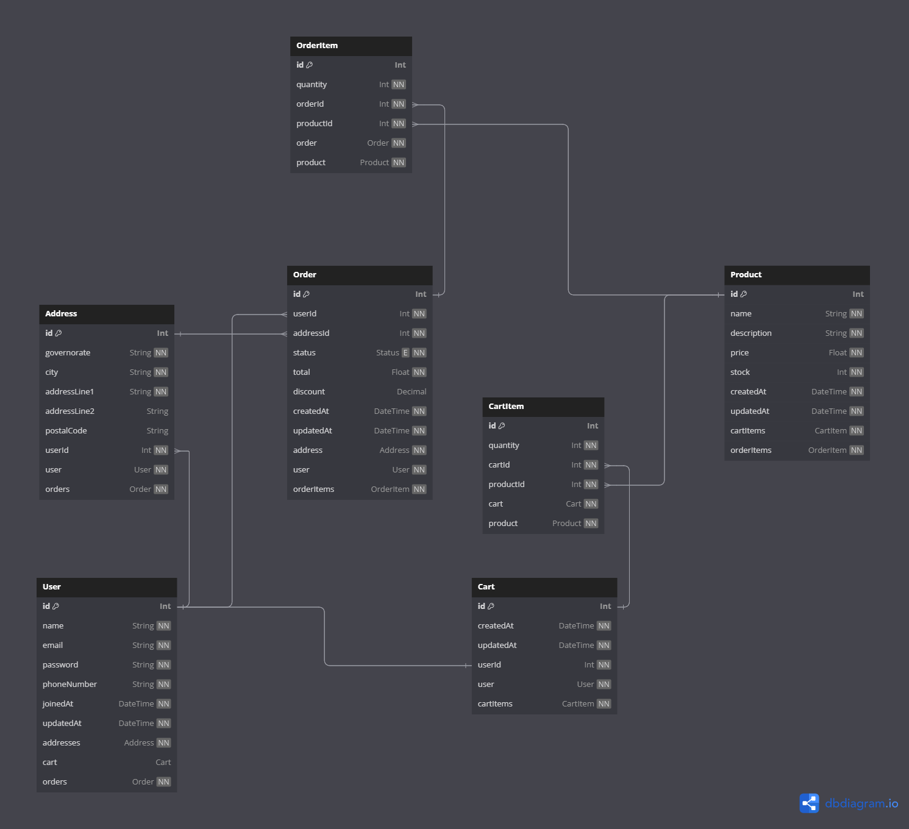

<p align="center">
  <a href="http://nestjs.com/" target="blank"></a>
</p>

  <p align="center">A progressive <a href="http://nodejs.org" target="_blank">Node.js</a> framework for building efficient and scalable server-side applications.</p>
    <p align="center">
<a href="https://www.npmjs.com/~nestjscore" target="_blank"></a>
<a href="https://www.npmjs.com/~nestjscore" target="_blank"></a>
<a href="https://www.npmjs.com/~nestjscore" target="_blank"></a>
<a href="https://circleci.com/gh/nestjs/nest" target="_blank"></a>
<a href="https://coveralls.io/github/nestjs/nest?branch=master" target="_blank"></a>
<a href="https://discord.gg/G7Qnnhy" target="_blank"></a>
<a href="https://opencollective.com/nest#backer" target="_blank"></a>
<a href="https://opencollective.com/nest#sponsor" target="_blank"></a>
  <a href="https://paypal.me/kamilmysliwiec" target="_blank"></a>
    <a href="https://opencollective.com/nest#sponsor"  target="_blank"></a>
  <a href="https://twitter.com/nestframework" target="_blank"></a>
</p>
  <!--[](https://opencollective.com/nest#backer)
  [](https://opencollective.com/nest#sponsor)-->

# Order Management System API

An order management system (OMS) API with extensible features.

## Technologies

- Node.js
- TypeScript
- Nest.js
- PostgreSQL
- Prisma
- Swagger
- JWT Authentication

## Architecture

### [Database Diagram](https://dbdocs.io/ahmadmashaal01/Order-Management-System?view=relationships)



### Dependency Graph


## Running the app

1. **Clone the repository:**

```bash
git clone https://github.com/relin404/order-management-system.git
cd order-management-system
```

2. **Install required packages:**

```bash
pnpm install # can also use npm or yarn instead of pnpm
```

3. **Build and start the Postgres Docker container:**

*Make sure to have [Docker Compose](https://docs.docker.com/compose/install/) installed.*

```bash
docker-compose up -d
```

This command will start the Postgres container in detached mode.

4. **Generate Prisma artifacts:**

```bash
pnpm dlx prisma generate # can also use npx instead of 'pnpm dlx'
```

This command will generate Prisma artifacts required for the repositories to work properly.

5. **Run the application:**

```bash
# development
$ pnpm run start

# watch mode
$ pnpm run start:dev

# production mode
$ pnpm run start:prod
```

## Testing the app

```bash
# unit tests
$ pnpm run test

# e2e tests
$ pnpm run test:e2e

# test coverage
$ pnpm run test:cov
```
